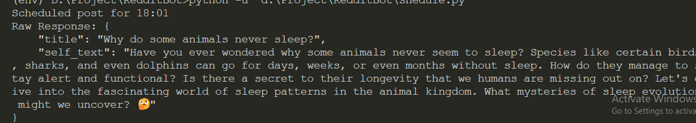
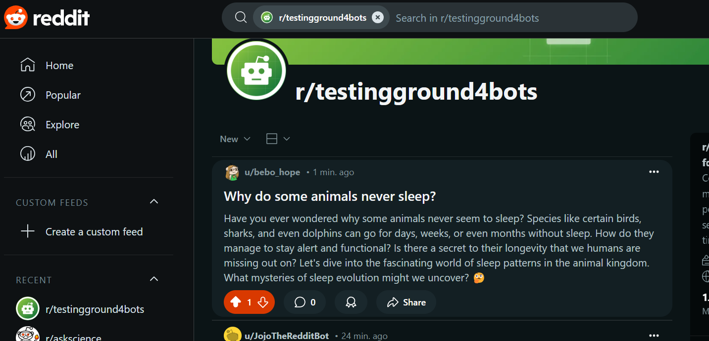

# Reddit Mistral Bot

The Reddit Mistral Bot is an automated Reddit content generation and posting bot that leverages Mistral AI to generate posts and comments. The bot can automatically post content to a Reddit subreddit and allows users to schedule posts at specific times.

# Features

- Daily Automated Posting: Posts are made at user-specified times of the day.
- Content Generation: Uses Mistral AI to generate creative and contextually relevant Reddit posts based on top posts from the target subreddit.
- Comment Generation: Can generate comments for posts (this feature is currently in development).
- Error Handling and Logging: Proper logging and error handling mechanisms are in place to ensure smooth operation.
- Scheduled Posting System: Users can set time slots for when they want posts to be automatically generated and submitted to Reddit.

## Streamlit App


## Base Implemenation




## Methodologyy

The Reddit Mistral Bot operates based on a few key principles:

1. Top Post Extraction: The bot extracts the top 5 posts from the specified subreddit. This is done by querying Reddit's top posts endpoint using the PRAW (Python Reddit API Wrapper) library. The bot fetches the titles and self-text of these posts, which provide context and help the bot understand the type of content that is performing well in the subreddit.

2. Keyword Integration: Users input a list of keywords they want the generated post to be related to. These keywords are used to steer the AI-generated content towards the user's desired topic or theme.

3. Prompt Formation: The bot combines the top 5 posts (extracted in the previous step) with the keywords provided by the user to form a detailed prompt for Mistral AI. The prompt may look something like this:

```python
You are a knowledgeable and curious Reddit user creating posts for the subreddit r{tagetsubreddit}. Posts should spark scientific curiosity or provide interesting insights in a conversational, natural, and human-like tone.

    Here are the top 5 posts from the subreddit to give you an idea of the style:
    {top_posts_text}

    Keywords: {keywords_text}

    Based on this information, generate a post with the following format:
    {{
        "title": "Your attention-grabbing title here",
        "self_text": "The additional details or context here. End with a thought-provoking question to invite discussion."
    }}

    Ensure the post is relevant to the subreddit, follows its rules, and provides accurate information. Now generate a post.
```

## Setup

1. Clone the repository
2. Install dependencies:

```bash
pip install -r requirements.txt
```

3. Create a `.env` file with your credentials:

```
REDDIT_CLIENT_ID=your_client_id
REDDIT_CLIENT_SECRET=your_client_secret
REDDIT_USER_AGENT=your_user_agent
REDDIT_USERNAME=your_username
REDDIT_PASSWORD=your_password
MISTRAL_API_KEY=your_mistral_api_key
TARGET_SUBREDDIT=your_target_subreddit
```

4. Run the bot:

```bash
streamlit run app.py
```

## License

MIT
